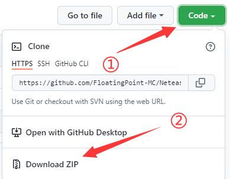
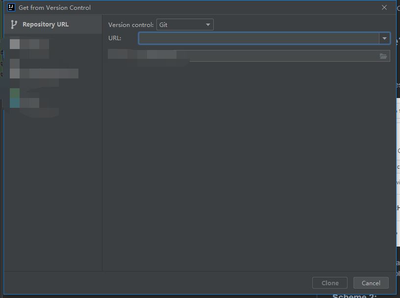

# NeteaseCheatPlus
NeteaseCheatPlus(NCP) is a new free open-source hacked client.

## How to use?
### Scheme 1:
1. Download the files & then unzip it

2. Unzip and open an IDE editor
3. Use your IDE tool to open the Maven-File(pom.xml)
### Scheme 2:
1. Copy the URL link(https://github.com/FloatingPoint-MC/NeteaseCheatPlus.git)
2. Paste it here:
3. Press "Clone"
4. Build the maven project
